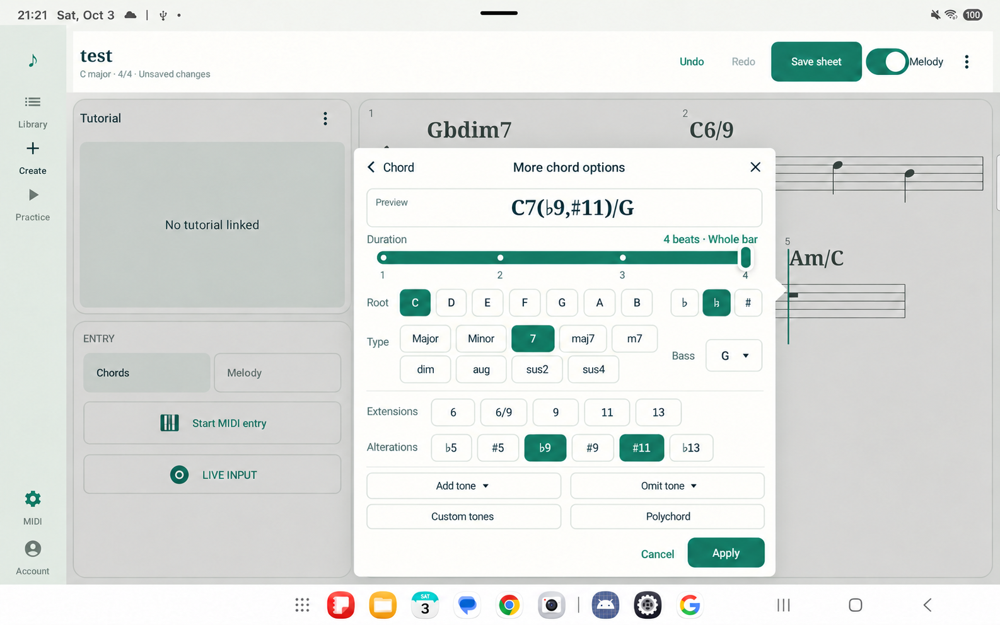

# Complete chord dialog implementation handoff

Implement the complete chord dialog for the Android tablet app. A chord or the append marker opens the dialog near that score location. Root and type choices are visible buttons, bass is a dropdown, and duration uses the melody-style slider. Chord edits shift later chords while melody retains its timing.

This is the implementation specification agreed on 3 October 2026. Sol owns coding, tests, documentation, application screenshots, and fixes from review. The parent agent owns this handoff, code review, and verification against the requirements. Completion requires the parent's review of code and evidence.

## Scope and visual reference

The image is a design reference, not completion evidence. The [captured tablet baseline](mockups/create-entry/chord-dialog-baseline.png) shows the real screen used for the design. Preserve its application chrome, score notation, tutorial, and visual language. Use one complete dialog as the normal entry surface. Its title is **Edit chord** or **Add chord**; the image's back link and “More chord options” heading are not part of this single-dialog design.

The Android UI is the main deliverable. Implement equivalent musical operations and score representation support in TypeScript contracts and the web model wherever needed for interoperability. A second web popup redesign is not required. Native-created scores must load, display, save, transpose, and participate in practice correctly on both clients. Existing scores remain readable.

## Dialog and interaction

| Area | Required behavior |
| --- | --- |
| Opening | Tapping a chord selects its whole logical chord and opens the dialog beside it. A plus marker immediately after the last chord opens Add chord. Selecting a chord never moves the append location. |
| Placement | Anchor to the actual chord or entry position. Flip or clamp at viewport edges and keep the selected location visible where possible. On smaller screens use a bounded scrolling dialog with persistent actions. Respect system bars and the tablet taskbar. |
| Root | Show C, D, E, F, G, A, B as spacious buttons. Show flat, natural, and sharp directly. Preserve spelling; double accidentals can use an additional structured choice. |
| Type | Show Major, Minor, 7, maj7, m7, dim, aug, sus2, and sus4 in spaced button rows. Root and these types never require opening a menu. Additional types remain reachable through a structured expansion within this dialog. |
| Complete controls | Show extensions, alterations, Add tone, Omit tone, Custom tones, and Polychord directly. Do not gate the complete view behind a compact dialog or More screen. Rare controls may expand a section or internal chooser. |
| Bass | Use an independent dropdown, initially Root. Any spelled bass note can be chosen, including one outside the chord. Changing root or type must not accidentally erase a chosen bass. |
| Symbol | Always show the constructed chord preview. New entry uses buttons, grids, and selectors; no free-text chord field or software keyboard. |
| Applying | Symbol construction remains a draft until Apply or Add. Apply changes the selected symbol without otherwise changing timing. Closing discards unapplied symbol changes. Add appends one chord, keeps the dialog open, and advances its anchor. Remember entry type and duration for repeated entry. |
| Duration | Reuse the melody slider's appearance and interaction. Snap to valid durations and preview the label during dragging. For an existing chord, release commits one duration edit and retains selection; cancellation makes no edit. For Add, it sets the next duration. Closing does not undo a completed slider edit; Undo does. Editing an existing chord must not change the duration remembered for new entry. |
| Deletion and history | Include Delete for an existing chord. Delete and each Apply, Add, or completed duration gesture produce one atomic undo step. No extra deletion confirmation. Undo restores music, created or trimmed bars, and relevant cursor state. |
| Accessibility | Use native semantics, logical focus/dismissal, visible selection, and at least 48 dp effective touch targets. Common root/type choices are visible at normal tablet text size; larger text can reflow and scroll without clipping. |

In 4/4, the normal slider has 1, 2, 3, and 4 beats, allowing one to four chords per bar with unequal durations. Initially use a whole bar, then remember duration choices. For other supported meters derive choices and labels from the actual meter, include a whole-bar choice, and do not mislabel quarter notes as denominator beats. Preserve the exact current duration for imported off-grid or longer logical chords. Opening the dialog must never quantize music. Existing denser scores must not be rejected merely for exceeding the new-entry shortcuts.

## Musical timeline rules

- Compute append from the last chord's end, independently of melody and selection. Fill existing time before creating bars. Opening Add at a virtual next bar does not persist an empty bar.
- Increasing or decreasing duration shifts every later chord by the exact difference. Deleting closes the removed duration. Preserve intentional existing gaps, order, symbols, spelling, and unrelated IDs. Never overwrite a following chord.
- Melody notes, explicit rests, ties, IDs, and absolute times remain unchanged by chord edits.
- A chord crossing barlines remains one logical editable chord. Any visible fragment selects it; duration, deletion, and symbol changes affect the whole chord. Persist this relationship across API save, reopen, recovery, import/export, and both clients. Separately entered adjacent identical chords remain distinct. Do not infer identity from equal symbols or encode it in a fragile naming convention.
- Trim only unused trailing bars. Authored melody, including explicit rests, protects a bar. Renderer-generated filler rests do not. Interior empty bars remain, and an empty score retains one bar. Save/load/recovery normalization must not subsequently remove protected bars.
- Validate complete edits before committing. Retain the existing 256-bar and per-lane event limits. Fail unrepresentable edits atomically and keep pending input available for correction.
- Preserve raw MIDI capture/recognition. Recognized chord entry uses the same append/correction operations. Opening or editing the dialog pauses capture. Unknown voicings can be assigned through the builder. Practice input never writes music.

## Chord coverage and representation

Use a composable definition, independent of the recognition vocabulary, for spelled root, family, extensions, additions, omissions, alterations, bass, custom tones, and stacked chords. Generate a deterministic display symbol and retain enough structure to reopen every control without losing intent.

| Feature | Acceptance examples and requirements |
| --- | --- |
| Basic and seventh families | Support major, minor, diminished, augmented, power, sus2, sus4, dominant seventh, major seventh, minor seventh, diminished seventh, half-diminished, and minor-major seventh. Include C, Cm, C5, Cdim7, Cm7b5, Cm(maj7), and C7sus4. |
| Extensions and additions | Support 6, m6, 6/9, 9, 11, and 13 with appropriate families, plus explicit added tones. Preserve the distinction between Cadd9 and C9. |
| Alterations and omissions | Allow simultaneous changes, including C7(b9,#11), C7(#5,#9), C13(b9), and C7(no3). Custom degree controls must not block an unusual valid combination because it lacks a preset. |
| Slash and spelling | Test Am/C, C6/9/E, F#m(maj7)/A#, a non-chord-tone bass, and double-accidental root/bass spelling. The slash in 6/9 is distinct from a bass slash. |
| Custom and stacked chords | A note/interval grid constructs arbitrary combinations in the existing 12-note system without typing. Give unnamed combinations a deterministic tone-based representation rather than inventing a standard name. Polychords retain independently editable components and a display distinguishable from one bass note. |
| No chord and legacy | Provide N.C. Preserve imported symbols that cannot be parsed. Permit their duration/deletion and explicit replacement; never substitute another chord on opening. |

Microtonal tuning is outside the current pitch system. Support ordinary Western symbols and any explicit tone set within that system. Ambiguous shorthand such as alt must not silently acquire one falsely definitive voicing.

Use one documented semantic model across Kotlin and TypeScript with shared fixtures. Update validation, serialization, API acceptance, recovery, imports/exports, rendering, transposition, and practice matching as necessary. Version the score contract if its strict schemas require it, retaining existing-version readers. Do not hide structure in a display string or silently truncate constructed symbols at the current 32-character limit. Limited automatic recognition must not constrain manual authoring or interpretation of structured chords.

Conceptual references are [MusicXML harmony](https://www.w3.org/2021/06/musicxml40/musicxml-reference/elements/harmony/) and [modified degrees](https://www.w3.org/2021/06/musicxml40/musicxml-reference/elements/degree/). The score format need not become XML.

## Cleanup and preserved melody

Remove the native chord keyboard, text field, duration/position pickers, Add/Change forms, redundant selection controls, and chord-entry bar buttons. Keep the tutorial, lane switch, MIDI setup/capture, and input feedback. Deliberate whole-bar insertion, if retained, belongs in a separate score/bar action and is unnecessary for sequential entry. Remove unused code and obsolete UI assertions.

Melody retains direct score entry, its nearby slider/rest/correction controls, pitch dragging, tied-note editing, and independent timing. Saving/recovery remain stable without moving the score. Preserve library, authentication, revision checks, and practice behavior.

## Implementation order and ownership

1. Sol creates its dedicated GitButler branch above the handoff. Implement the semantic chord model and pure timeline operations with shared musical fixtures first.
2. Sol integrates persistence, recovery, compatibility, transposition, and practice. Identify migration requirements before writing new score data.
3. Sol builds the complete native dialog, real score anchors, append marker, state transitions, MIDI integration, and left-panel cleanup.
4. Sol runs focused product tests and relevant repository checks, fixes failures, captures real UI evidence, and updates contracts and verification documents.
5. The parent reviews code, acceptance mapping, test evidence, and screenshots. Sol implements review corrections and reruns affected checks. The parent performs final review.

Sol performs all implementation, test authoring/execution, documentation after this handoff, and screenshot capture; do not delegate these tasks further. Use GitButler and follow AGENTS.md. Do not rewrite other branches or push/open a PR. Use Context7 outside the sandbox for library-specific API questions as instructed; ordinary business logic does not require it.

## Verification and completion evidence

| Area | Required evidence |
| --- | --- |
| Chord semantics | Shared fixtures cover every supported family, all root pitch classes, independent basses, multiple alterations, omissions, spelling, 6/9 with bass, custom tones, polychords, long labels, and legacy preservation. Check semantic round trips, transposition, and practice. |
| Timeline | Verify append, all 1–4-beat patterns in 4/4, longer/shorter middle chords, shifts over several bars, cross-bar identity, adjacent identical chords, preserved gaps, explicit-rest protection, trailing cleanup, limits, and atomic failure. Assert melody is unchanged. |
| History/storage | Exercise undo/redo, save/reopen, recovery, both clients, and supported import/export. A cross-bar chord must still be one chord after round trips. |
| Native interaction | Exercise actual controls for open/edit/add, root/type grids, bass, alterations, custom tones, polychords, Apply, slider release/cancellation, Delete, repeated addition, Close, and MIDI pause. View-model-only calls do not establish UI acceptance. |
| Layout | Capture anchors at different score locations, including bottom/right edges, plus portrait or narrow layout and larger text. Verify touch targets, scrollable content, persistent actions, and the cleaned left panel. |
| Regression | Run relevant native unit tests, lint, debug build, and instrumentation acceptance, plus shared/web/API checks affected by format and persistence changes. Preserve product MIDI tests. Do not add/run development-only tooling tests prohibited by AGENTS.md. |

Use disposable accounts/sheets and the isolated backend. The physical SM-X610 was available as R52X50CFTMW, but rediscover devices. Its normal app has an unsaved sheet named test. Preserve that session/data; never clear app storage or overwrite the user's score for evidence. Existing opt-in native product tests use an isolated model without the normal session store; prefer that pattern. If the device is unavailable, use the repository tablet emulator and state that limitation.

Save real application screenshots under docs/architecture/evidence/chord-dialog/ and the verification record at docs/architecture/chord-dialog-verification.md. Include exact commands, pass/fail/skipped counts, device/build identity, captions, and a requirement-to-evidence checklist. Capture the full dialog with roots/types and advanced controls, a slash/altered chord, append creating a bar, a duration/deletion result, and a constrained layout. Generated images are not completion evidence.

Update this plan's status, chord-authoring.md, affected score/persistence contracts, the architecture index, and current mockup guide. Keep only the complete dialog as the current design while preserving historical verification records. Report genuinely unfinished acceptance items rather than declaring full completion.
