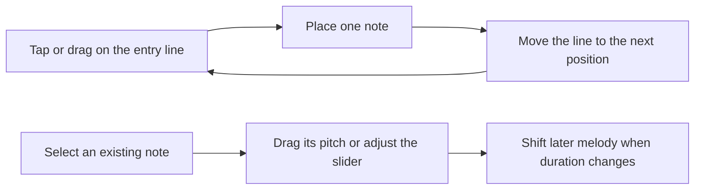

# Create view: fast music entry

Create accurate lead sheets with as few taps as possible, on Android tablets and the web.

The [complete chord dialog implementation handoff](chord-dialog-implementation-plan.md) defines the current tablet chord design, timing operations, coverage, and acceptance criteria. The melody workflow below remains current. Chord controls described in the existing verification record document the earlier implementation rather than the new acceptance target.

## Interface

- You enter and edit melody directly in the score.
- A visible line marks the next note position. Tap it at the desired pitch, or drag vertically before releasing.
- One slider beside the entry line or selected note sets the next duration or changes the selected note.
- A Rest control appears beside the entry position or selected note. Selecting a note also exposes accidental and tie controls nearby.
- Chords open a complete anchored dialog with visible root/type buttons, a bass dropdown, a duration slider, and structured advanced controls.
- The tutorial stays in its panel. There is no separate tutorial visibility row.
- Save notifications disappear automatically and do not move the score. Recovery copies are saved silently.

## Interaction

| Task | Behavior | Actions |
| --- | --- | --- |
| Enter a note | Tap the line at the desired pitch, or drag and release. Entry always continues after the last note or rest. | 1 gesture |
| Delete a note | Select the note and tap Delete. Later melody moves back to close its duration. | 2 taps |
| Correct a pitch | Drag a note vertically. Its position and duration stay fixed. | 1 drag |
| Change duration | Select the note and adjust the slider. Later melody shifts by the duration difference; chords stay fixed. | 1–2 actions |
| Enter a rest | Tap the Rest control beside the entry line. | 1 tap |
| Replace a note with a rest | Select the note and tap Rest. Its duration stays the same. | 1–2 taps |
| Enter a chord | Use the append marker and complete dialog. The cursor advances and adds bars as required. | See chord handoff. |
| Edit a chord | Tap it to open the complete dialog. Duration changes and deletion shift later chords. | See chord handoff. |

## Musical rules

- New notes and rests follow the existing melody automatically. Selecting a note edits it without changing the next entry location.
- Chords append sequentially. Duration edits and deletion shift later chords while melody stays fixed, as specified in the chord handoff.
- Extending the music adds bars as needed. Notes that cross barlines split into tied fragments; rests split without ties.
- Selecting any tied fragment selects the whole sounding note. Pitch, duration, rest replacement and deletion apply to the entire chain.
- Unused time appears as rests so each measure contains its full beat count. Automatic rests do not advance the entry line.
- Chord cleanup removes unused trailing bars while protecting authored melody, including explicit rests. Silent interior bars remain, and Undo restores removed bars.
- Editing a selected note preserves the duration remembered for new notes.
- Each completed gesture is one undoable action. Cancellation changes nothing.
- MIDI writes on physical key release. Sustain does not delay insertion. A duration change while keys are held applies to the next gesture.
- Editing, saving, leaving Create and disconnecting pause MIDI capture. Practice never writes music.
- Edits validate atomically. The limits remain 256 bars and 64 events per lane per bar; unsupported rhythms remain pending with an explanation.

The [melody rules](melody-authoring.md) cover timing, ties and import. The [chord contract](chord-authoring.md) records implemented recognition and authoring; Sol updates it alongside the new chord implementation.

## Implementation order and testing

| Order | Work | Acceptance check |
| --- | --- | --- |
| 1 | Implement sequential entry and duration changes in both timing models. | Verify shifts in both directions, rests, barline splits, IDs, tied groups, deletion, complete measures, limits and undo. |
| 2 | Connect the cursor and gestures to the existing score renderers. | One release creates one note. Dragging changes pitch without moving its onset. |
| 3 | Add nearby rest and correction controls, and remove redundant controls. | The score is the only entry stave. Melody has no bar picker, note form or Change last action. |
| 4 | Keep notifications outside the score layout. | Saving preserves the score's vertical position. |
| 5 | Verify the tablet, browser, persistence and responsive layouts. | Save and reopen exact music; preserve recovery, conflicts and read-only practice. |

- Use disposable accounts and sheets for product acceptance tests.
- Repeat entry with rests, dotted values and a note that crosses a barline.
- Test cancelled gestures, a second finger, keyboard controls and narrow layouts.
- Measure eight chords and sixteen notes over three practiced trials. The targets remain 30% faster completion, 50% fewer manual-melody taps, and 95% of updates within 100 milliseconds. These are unmeasured targets.
- The [verification record](fast-entry-verification.md) contains results, screenshots and repeatable checks.
