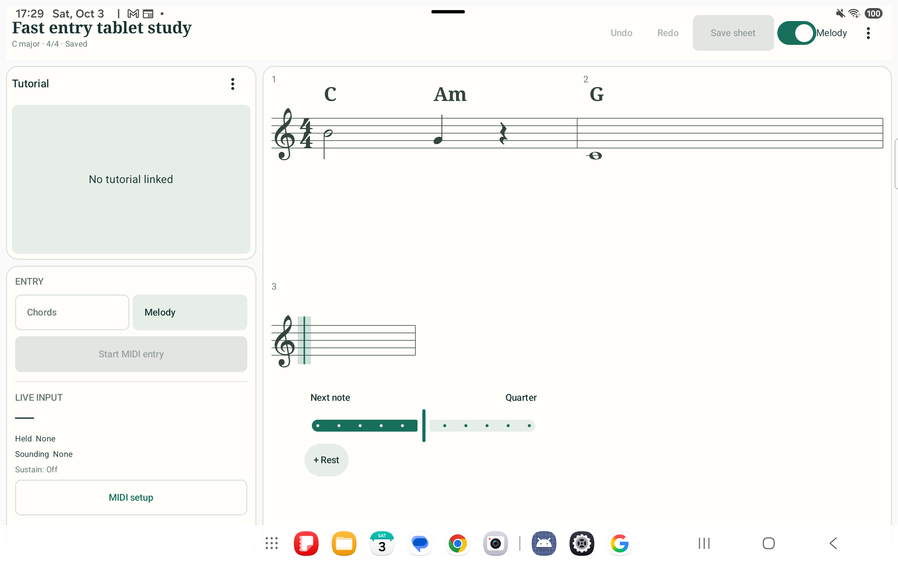
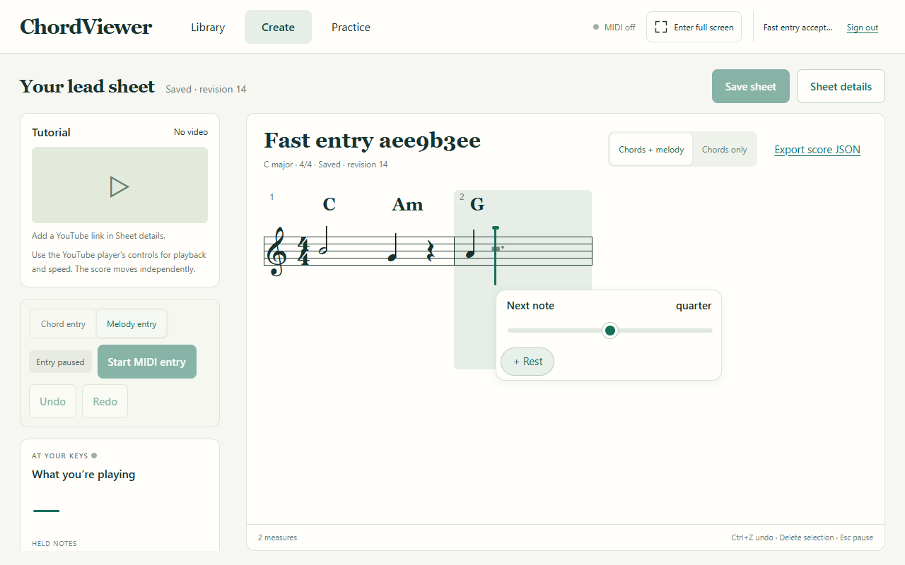

# Fast entry verification

Verified on 3 October 2026 with disposable accounts and the isolated test backend.

| Check | Result |
| --- | --- |
| JavaScript unit tests | The full suite passed 401 tests. Follow-up runs passed 44 editor, library and recovery tests and five layout tests, including the new chord-drop regression. |
| Android unit tests | All 113 tests passed. |
| Browser acceptance | All 27 applicable tests passed across the suite and focused follow-up runs. Five live-MIDI tests were skipped. |
| Physical tablet | The direct-entry acceptance test passed on the Samsung SM-X610. The final debug build is installed. |
| Build and lint | Web, shared contracts and API builds passed. Android debug and test builds and lint passed. |

The entry checks exercise continuous chords, exact overwriting, bar extension, chord dragging, sequential note placement on the score, pitch dragging with fixed timing, duration changes that shift later melody, nearby rest insertion and replacement, whole tied-note selection and editing, deletion that closes the removed duration, complete measure notation, silent recovery, cancellation, undo, and saving and reopening. Trailing-bar checks cover shortening, deletion, rest replacement, preserved interior silence and chords, continued entry, and cleanup without false unsaved-change warnings. The browser suite also covers recovery, failed saves, conflicts, import/export, dense note selection, responsive layouts and read-only practice.

The existing “Someone Like You” score was also inspected. Bars 1, 2, 3 and 7 contain unused time; automatic rests now make all seven 4/4 bars display four beats without changing the saved note timings. The normal tablet library loads successfully.

Review found and corrected a chord-drop timing error caused by signature padding and uneven notation spacing. Unit and browser regressions verify that dragging a chord onto a rendered beat places it at that beat.

## Screenshots

[Narrow browser layout](evidence/fast-entry-web-narrow.png)

## Repeating the checks

- Run `npm run check` for JavaScript lint, unit tests and production builds.
- Start the isolated test backend using the [development instructions](../../README.md), then run `npx playwright test`. Set `CHORDVIEWER_BROWSER_CHANNEL=chrome` to use an installed Chrome instead of Playwright's bundled browser.
- Run the Android Gradle tasks `testDebugUnitTest`, `lintDebug`, `assembleDebug` and `assembleDebugAndroidTest`.
- Install both debug APKs, forward device port 3001 to the isolated backend, and run `com.chordviewer.library.FastEntryUiTest` with the instrumentation argument `fastEntryUi=true`. The test creates its own account without using session or recovery storage.
- Keep device port 3000 forwarded to the development backend so the normal tablet application can load the user's library after testing.

## Remaining manual checks

- Run the optional live-MIDI acceptance tests with the physical input setup.
- Complete a screen reader walkthrough and timed user trials. The speed, tap-count and latency targets in the [plan](create-entry-plan.md) are not measured results.
