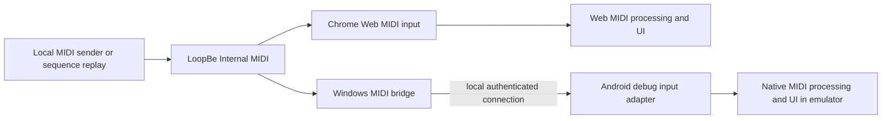

# Local MIDI testing without a piano or tablet

Updated: 2026-09-20. Routine testing will use this computer's MIDI loopback setup, a desktop browser and the Android emulator. This replaces the earlier requirement to prove a physical piano/tablet connection before building the editor.

## What is verified now

| Check | Result |
| --- | --- |
| Windows driver | LoopBe1 is installed; Windows reports the device as `nerds.de LoopBe1 - Internal Midi Port (WDM)`. |
| MIDI ports | WinMM enumerates `LoopBe Internal MIDI` as both an input and an output. |
| Original web reference (M1) | Started locally at `http://127.0.0.1:5173/` and tested in Chrome after the user enabled MIDI permission. The app selected `LoopBe Internal MIDI`. |
| Rebuilt web client (M2) | The real LoopBe fixture passed in Chrome: C major, sustain, zero-velocity note-off, channel 2, final clear and reselecting the active input. See the [M2 verification record](../development/m2-verification.md). |
| Note input | A temporary native Windows sender sent MIDI notes 60, 64 and 67 at velocity 96. The app displayed `CM` and `C E G`. |
| Sustain | Sending CC64 = 127 followed by note-offs kept the chord visible and showed Sustain. Sending CC64 = 0 cleared the notes. |
| Alternate note-off | Note 62 followed by note-on with velocity zero left no stuck note. |
| Android tools | Studio 2026.1.4 Patch 1, JDK 21, SDK 35 and Emulator 37.1.11 are installed. WHPX acceleration and a tablet emulator using host graphics work; see the [local setup guide](../development/local-setup.md). |
| Native emulator | The real LoopBe fixture passed through the Windows bridge to native MIDI processing: notes, sustain, zero-velocity note-off, channels, clear and reconnect reset. Native UI rendering and background cleanup also passed; see the [verification record](../development/m1-verification.md). |
| Windows bridge | The committed bridge passed real LoopBe round-trip tests in PowerShell 5.1 and 7: byte ordering, timestamps, sustain, channel separation, reconnect reset, authentication, malformed input, credential ACL and cleanup. |
| Other installed software | MIDIculous 4.1.13 is installed. Its MIDI configuration was not altered or used for this test. |

These are real Windows-driver-to-Web-MIDI checks. The original reference used a temporary sender; M2 uses the committed [fixture sender](../../scripts/midi/README.md). Both the rebuilt web client and the native M2 app now pass their local input acceptance checks. This establishes the input path; it does not yet test an editor, every MIDI case or physical device hot-plug behavior.

## Test routes

For the web client, use the real browser MIDI input. A small sender or suitably configured MIDI application writes to the LoopBe output, and the web app listens to its input. LoopBe1 is designed to transfer MIDI between applications and supports multiple readers, so the browser and future bridge can receive the same stream. Receivers must not echo it back into the same LoopBe port. [LoopBe1 documentation](https://www.nerds.de/en/loopbe1.html).

For Android, the Windows port does not appear automatically in Android's device list. Google's documented emulator limitations include USB, while its networking documentation supports communication with the host. The implemented bridge forwards LoopBe events over a loopback-only TCP connection through `adb reverse` to a debug adapter in the native app. Both Windows-side tests and end-to-end native emulator validation pass. [Emulator limitations](https://developer.android.com/studio/run/advanced-emulator-usage), [emulator networking](https://developer.android.com/studio/run/emulator-networking).

## Android bridge design

- Keep production device input and debug input behind the same native processing boundary. Forward MIDI bytes, channel, ordering and timing information; do not send precomputed chord names or mutate the editor directly.
- The Windows bridge listens to LoopBe and binds its endpoint only to the host loopback interface. The emulator connects through a local development forwarding route. Authenticate each connection with a random per-run token stored outside version control; bound queues, frame sizes and connection counts, and validate message types and MIDI bytes. Reject unexpected input and never echo events back into LoopBe. Keep the bridge independent of the product backend, so MIDI tests do not depend on the NAS or cloud.
- Preserve event ordering and replay intervals without assuming Windows and Android clocks share an epoch. On reconnect, clear stale held/sustained state instead of replaying old live notes.
- Compile the test transport into debug/test builds only. Release builds use native device input and do not expose this test endpoint or selection UI.
- Start with a debug adapter feeding the same parser/state path as device input. If testing Android MIDI discovery and port opening becomes necessary, a test-only virtual `MidiDeviceService` can provide an additional integration layer, subject to support in the selected emulator image. Android documents this API as a virtual MIDI device service; it still does not emulate a physical USB cable. [MidiDeviceService reference](https://developer.android.com/reference/android/media/midi/MidiDeviceService).

The native application remains Kotlin/native UI in the emulator. No browser wrapper is proposed.

## Repeatable coverage to build

Use the same original event fixtures and expected musical results for both clients, with a software replay source for repeatability and interactive input for exploration.

| Area | Scenarios |
| --- | --- |
| MIDI state | Note-on/off, zero-velocity note-on, sustain on/off, repeated notes, channel handling, disconnect/reconnect and clearing stale notes. |
| Recognition and entry | Triads/sevenths, inversions, octave duplication, rolled chords, overlapping gestures and one insertion per intended gesture. |
| Musical timing | Selected durations, rests and melody/chord passes; held-key time does not alter selected score duration. |
| Corrections | Undo, redo, change and delete after automatic insertion; paused input and explicit replacement. |
| Practice | Manual movement, matching-chord advancement, repeated chart chords requiring fresh gestures, and no score mutation. |
| Persistence and layout | Save/reopen, temporary backend loss, agreed draft recovery, tablet-sized native layout and browser layout. |

These cases are planned coverage, not claims that they already pass. Normal CI can replay fixtures directly into each client's processing layer without requiring the Windows driver; local integration tests additionally exercise LoopBe and the emulator bridge.

## Remaining work and limits

Android tools, the native diagnostic and real emulator fixture test are verified. Use the documented host-graphics profile; software rendering stalled on this workstation. Initial concurrent Gradle/emulator execution put the 16 GB workstation under memory pressure, so finish the build and stop its daemons before starting the emulator. Run only the services needed for the current test; local backend/database integration follows in M3. NAS deployment is deferred until after complete local validation and is not required for this setup.

Neither a piano nor tablet is required for this workflow. It validates musical logic, editing, application state and native UI behavior. Physical USB/Bluetooth discovery, real-device latency, cable/power behavior and Samsung-specific behavior remain outside its coverage. Record those as unverified rather than claiming emulator results prove hardware compatibility.

See the updated [milestones](milestones.md) and [setup plan](setup-and-cleanup.md).
