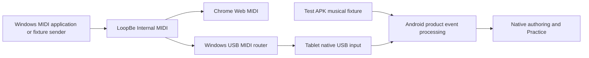

# Local MIDI testing

Updated: 3 October 2026. Browser checks use real LoopBe input. Android emulator checks use musical fixtures confined to the test APK. Live Android input uses the [physical USB workflow](../development/usb-midi.md).

## Input routes

```mermaid
flowchart LR
    sender[Windows MIDI application or fixture sender] --> loop[LoopBe Internal MIDI]
    loop --> web[Chrome Web MIDI]
    loop --> router[Windows USB MIDI router]
    router --> tablet[Tablet native USB input]
    fixture[Test APK musical fixture] --> model[Android product event processing]
    tablet --> model
    model --> native[Native authoring and Practice]
```

The browser selects LoopBe and grants MIDI permission. The Windows router forwards LoopBe to the explicitly selected tablet destination. Receivers never send input back into LoopBe. [LoopBe1 documentation](https://www.nerds.de/en/loopbe1.html).

The emulator remains useful for native UI, editing and backend tests. Its installed app has the same native USB input as the physical tablet, with no network MIDI transport. `MidiProductFixture` exists only in `androidTest` and delivers ordered bytes and resets on the main thread through `LibraryViewModel.onMidiEvent`. It does not simulate physical USB discovery, port health, latency or the live-note-card snapshots.

## Verification and coverage

| Route | Scope |
| --- | --- |
| Browser LoopBe | Original fixtures exercise Web MIDI, notes, sustain, channel separation, authoring and Practice. |
| Android product fixtures | Native UI tests exercise musical entry, correction, history, Practice, persistence and reset behavior. JVM tests cover parsing, gestures, connection health and recognition. |
| Physical tablet USB | The [verification guide](../development/usb-midi.md#verification) records measured receipt, gesture handling, router failure/recovery and Activity reuse. Remaining hardware cases are listed there. |

The historical [M1](../development/m1-verification.md), [M4](../development/m4-verification.md), [M5](../development/m5-verification.md), [M6](../development/m6-verification.md) and [M7](../development/m7-verification.md) records describe the tooling and transport used for those dated runs.

| Product area | Required scenarios |
| --- | --- |
| MIDI state | Exercise note-on/off, zero velocity, sustain, repeated notes, channels, clearing and interruption. |
| Recognition and entry | Exercise triads/sevenths, inversions, rolled chords, overlapping gestures and one insertion per intended gesture. |
| Musical timing | Selected durations, rests and separate melody/chord passes must survive input timing changes. |
| Corrections | Undo, redo, change, delete and one-shot replacement must preserve unrelated music. |
| Practice | Fresh matching gestures advance once and never change the saved score. |
| Persistence and layout | Save/reopen, backend loss, draft recovery and native/browser layouts use the shared contract. |

## Workstation limits

Build Android before booting the emulator to limit memory pressure on the 16 GB workstation. Use the documented hardware graphics profile and start only the services needed for the current check. The [setup guide](../development/local-setup.md) records the configured tools.

Emulator fixtures do not require a piano or tablet. Hardware USB discovery, cable reconnection, device sleep and real-device latency require separate physical checks. NAS deployment remains separate from local MIDI testing.
