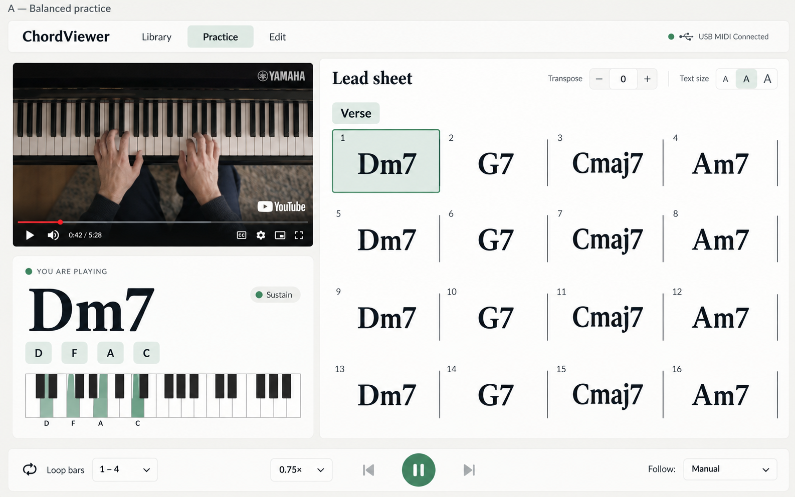
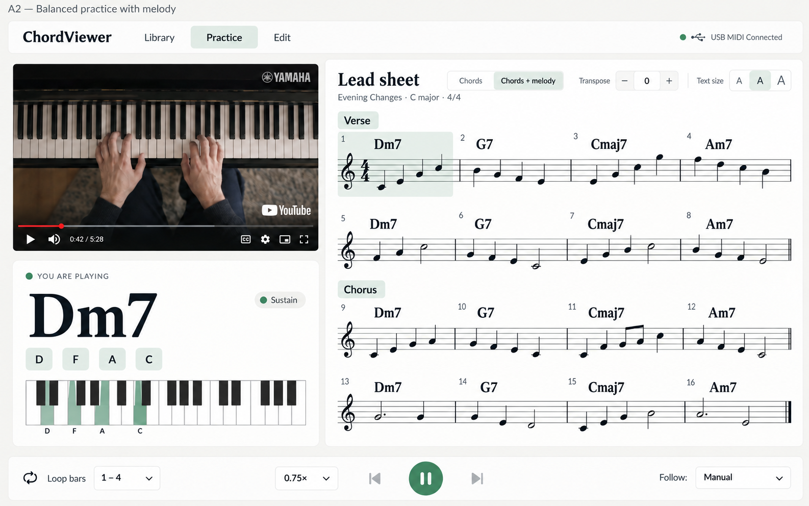
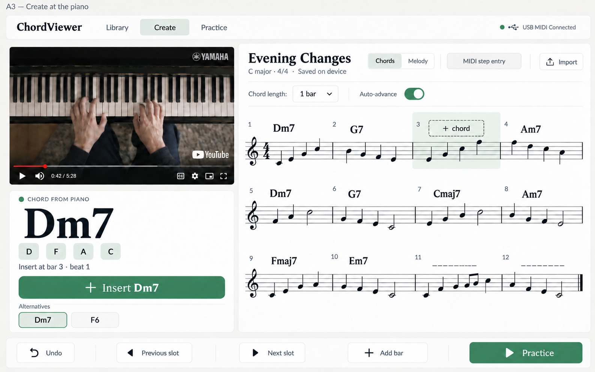
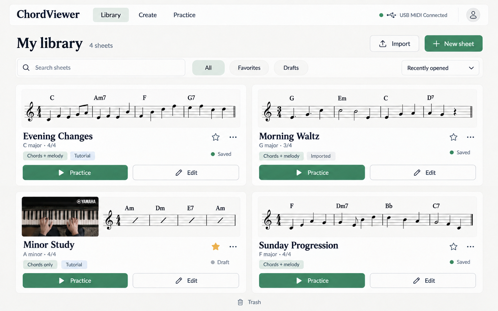
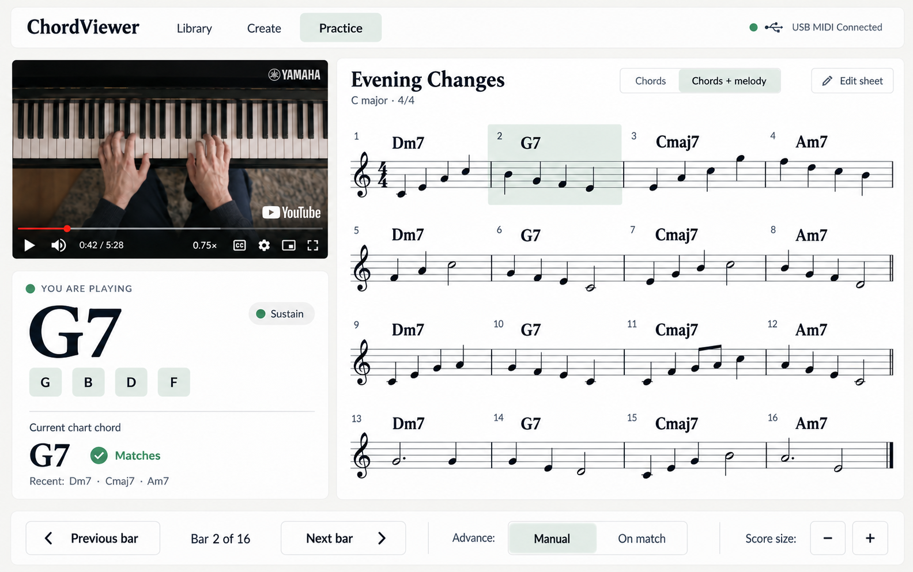

# Selected mockups

These are the relevant saved concepts from the planning discussion. They share a warm white and sage palette, large touch targets and a landscape layout suitable for the browser and native tablet app. They are design references, not implemented screens.

The [product plan](../product-plan.md) governs behavior when an older image differs. Generated music glyphs are illustrative and must not be used as score data or notation test fixtures. The populated Library is an example; a new user's library starts empty.

## A — Selected balanced layout

The user selected this arrangement: tutorial at upper left, live played-chord feedback below, and the lead sheet on the right. The later Practice concept below refines its controls.

## A2 — Melody notation

The same layout with chord symbols above a melody staff, without lyrics. This establishes the visual direction for optional melody; exact supported notation remains an open decision.

## A3 — Create at the piano

This earlier creation exploration shows the insertion target, chord/melody pass selection and live input preview. Its **Insert** button is superseded by automatic insertion with easy Undo, Change and Delete. The proposed current behavior commits after the physical keys are released, then advances by the selected duration; precise gesture handling remains to be defined. A manual confirmation step is not part of the accepted default.

## Library — Personal sheets and imports

Search, filters, New sheet and Import lead into cards with distinct Practice and Edit actions. There is no shared catalog in the first release. The illustrated titles and music are sample content, not an initial user library.

## Practice — Manual or matching-chord navigation

The latest Practice concept preserves layout A, shows the played chord alongside the current chart chord, and keeps video playback separate from score movement. Manual navigation is selected by default; On match is an optional alternative. MIDI input never edits the sheet in Practice.

## Design provenance

The PNGs are unchanged copies of the selected generated images from the planning discussion. Rejected alternatives and duplicate intermediate revisions are omitted. Available [generation and revision prompts](prompts.md) are retained for later iteration; they are historical briefs and do not override subsequent product decisions.
