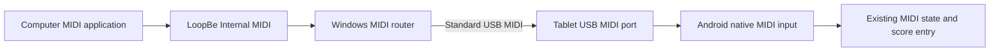

# USB MIDI connection design

Implemented on 3 October 2026 after successful hardware checks on the ASUS Zenbook UP3404VA and Samsung SM-X610 running Android 16. The design sends LoopBe MIDI through a standard USB MIDI connection, with the computer as USB host and the tablet as USB MIDI peripheral. MIDI connection requires no session code or ADB forwarding. The [setup and verification guide](../development/usb-midi.md) records the tested behavior and remaining physical acceptance cases. An Astra subagent approved all implementation code.

## Connection and user experience

The user starts the computer router, connects the USB cable, selects **MIDI** in the tablet's USB preferences when necessary, and opens ChordViewer. A previously selected input reconnects automatically. The tablet displays **Computer via USB**, its readiness, and **Disconnect** and **Clear notes** controls. Connecting never starts score entry; the user explicitly resumes entry after an interruption.

Android exposes its own peripheral port, not the Windows LoopBe device. In the proof, Windows called the destination **MIDI function**, and Android called the input source **Android USB Peripheral Port**. These are observed names, not identifiers to hard-code. Ordinary Android applications cannot silently change the system USB function. A cable-only experience depends on the tablet retaining or defaulting to MIDI mode, which is not yet verified. [Android USB MIDI configuration](https://source.android.com/docs/core/audio/midi), [system USB function controls](https://android.googlesource.com/platform/frameworks/base/+/master/core/java/android/hardware/usb/UsbManager.java).

The computer's USB host role does not restrict the direction of MIDI data. A direct piano connection uses the tablet as host; both connections can feed the same Android MIDI receiver and musical processing. This design does not require the laptop to expose a USB device controller or install a custom Windows kernel driver.

## Hardware proof

The [saved proof evidence](../development/usb-midi-hardware-proof.json) contains both sent and received byte streams, native discovery and removal events, endpoint enumeration, probe isolation, and restoration checks.

| Check | Measured result |
| --- | --- |
| Initial Windows outputs | Only the Windows synthesizer and LoopBe were present. |
| USB MIDI discovery | Enabling MIDI exposed a new Windows output and an Android `TYPE_USB` device with one input and one output port. |
| Native receiving | A separate probe opened Android output port 0 through `MidiManager`. Its manifest had no Internet permission and its code had no socket or relay transport. |
| First sequence | All 16 messages and 48 bytes arrived in exact order. The sequence included a triad, sustain across note releases, zero-velocity note-off, a second MIDI channel, and cleanup. |
| USB configuration reconnect | Switching out of MIDI removed both endpoints. Switching back produced a new Android device ID, reopened the port, and delivered the same 48 bytes exactly. |
| Sender shutdown | The Android MIDI device remained present after the Windows sender closed its handle. An available port does not establish router health. |
| Restoration | The original current and default USB configuration were restored. Backend forwarding was restored, backend health returned HTTP 200, the probe was uninstalled, and the original running ChordViewer task was resumed. |

ADB was enabled for temporary USB configuration and evidence collection; no MIDI bytes traveled through ADB. USB reconfiguration interrupted ADB and removed its reverse mappings. Verification used effective device state rather than the mode-switch command's exit status, which was 255 when its own connection re-enumerated.

This initial probe proves Windows-to-tablet native USB MIDI receipt on the attached hardware. The subsequent [implementation check](../development/usb-midi.md#verification) also passed LoopBe routing into ChordViewer's native input and shared gesture engine, router timeout and recovery, manual disconnect, and Activity/ViewModel reuse. Direct shell authoring, unsaved draft and undo preservation, physical cable reconnection, MIDI mode persistence, piano compatibility, and latency remain unmeasured. Operation with debugging disabled was not exercised. Receipt timestamps use the tablet's local clock and do not establish cable latency.

## Windows router

- Reuse the existing WinMM input and bounded worker approach. Listen to **LoopBe Internal MIDI** and send ordered MIDI 1.0 channel messages to the selected tablet output using `midiOutShortMsg`, outside the input callback.
- Require explicit selection of the tablet destination on first use, even when only one external output exists. Remember its opaque Windows MIDI device interface and name only when unique. Re-resolve this association after reconnect; never persist a numeric WinMM index. If an indistinguishable duplicate is observed, invalidate the saved choice under the router's exclusive lock before continuing with an explicitly selected attachment. If identity cannot be established or an ambiguous attachment is lost, ask for selection again. If the remembered tablet is absent, wait without substituting another output or sending it cleanup commands.
- Reject LoopBe as an output destination and never echo incoming events into it. Preserve channel and byte ordering. SysEx, MIDI clock routing, audio generation, and musical recognition remain outside this component.
- Bound the queue to 1,024 messages. Overflow, input failure, or output failure ends the connection and discards queued events. Do not replay old note events after reconnect.
- Before forwarding a new connection, send sustain-off (`CC64=0`), all-sound-off (`CC120=0`), and all-notes-off (`CC123=0`) on all 16 channels, then the first Active Sensing byte. Serialize this complete startup sequence ahead of notes and recurring heartbeats. Stop forwarding and heartbeats before graceful shutdown cleanup. These cleanup messages also establish the reset-and-pause boundary described below. Report failures and close only owned MIDI handles.
- Integrate the router into a physical-tablet launcher mode without starting the emulator. Emulator musical tests inject product events from the test APK; the app uses native USB input in both build variants.

[Windows short-message API](https://learn.microsoft.com/en-us/windows/win32/api/mmeapi/nf-mmeapi-midioutshortmsg), [WinMM input callback restrictions](https://learn.microsoft.com/en-us/previous-versions/dd798460(v=vs.85)).

## Android input and connection health

Native MIDI input lives in the shared Android source set, available in debug and release builds. Enumerate MIDI 1.0 byte-stream devices, observe addition and removal, and receive from the chosen device's `MidiOutputPort` using `MidiReceiver`. Support both the tablet's peripheral port and a piano attached in host mode. Do not require `PROPERTY_USB_DEVICE`: it was absent on the verified peripheral device. [Android MIDI discovery and port direction](https://developer.android.com/reference/android/media/midi/package-summary).

Copy callback buffers before asynchronous delivery. Feed every ordered byte event through the existing parser and gesture boundary; live screen snapshots may be coalesced, musical events may not. Use the existing bounded queue and connection generation rules to reject stale callbacks. Only one selected input owns musical state at a time. [Receiver buffer contract](https://developer.android.com/reference/android/media/midi/MidiReceiver).

Require explicit first-time Android input selection. Remember the source mode, MIDI port, and available manufacturer, product, name, and USB identity properties. Android device IDs are connection-local; the proof changed IDs after reconnect. For Computer bridge mode, resolve only a unique local USB peripheral endpoint matching the remembered properties, without requiring `PROPERTY_USB_DEVICE`. For a piano, use its USB identity when available. Missing sources remain disconnected; ambiguous or indistinguishable candidates require selection rather than taking the first device.

For **Computer bridge** mode, use MIDI Active Sensing (`0xFE`) to detect a stopped router while the USB port remains open. The router sends it after startup cleanup and targets one byte every 100 ms while its input and output worker are healthy. Android waits for the first Active Sensing byte before marking the bridge ready. Once ready, its watchdog resets and pauses input after 300 ms without any MIDI bytes. Use monotonic callback-arrival time, not the MIDI message timestamp or UI delivery time. Check for an expired health interval before accepting a newly arrived batch or refreshing the deadline, so recovered notes cannot complete an old gesture. Heartbeats do not enter score gestures or alter running status. The heartbeat interval and scheduling behavior remain unmeasured implementation targets; 300 ms follows the Active Sensing timeout. [MIDI Active Sensing](https://midi.org/summary-of-midi-1-0-messages), [MIDI traffic and Active Sensing](https://midi.org/about-midi-part-3midi-messages).

In Computer bridge mode, receiving a complete `CC120=0` or `CC123=0` on any channel is a connection reset boundary: clear all musical and parser state, discard pre-boundary queued events, pause score entry, and return to waiting for Active Sensing. Apply this rule to forwarded cleanup commands as well as router startup and shutdown. A fresh heartbeat restores transport readiness but never rearms entry. This detects a restart even inside the watchdog interval. It is a ChordViewer input policy; general MIDI inputs keep their normal channel cleanup semantics. The router does not send MIDI System Reset (`0xFF`) automatically.

An input error, queue overflow, source change, device removal, health timeout, or background suspension clears held and sustained notes, cancels incomplete gestures, and pauses entry. After recovery, reset parser and queue state, restore transport readiness, and require explicit resumption of score entry. In Computer bridge mode, ignore musical input while waiting for the router to become ready. **Disconnect** suppresses automatic reconnection until the user chooses Connect again. **Clear notes** resets live state and pauses entry without changing the sheet.

For a general MIDI input, such as the piano, do not require Active Sensing from a device that never sends it. Enable its watchdog after the first Active Sensing byte. On timeout, clear notes and pause entry, then return to operation without a watchdog until another Active Sensing byte arrives. Computer bridge mode instead retains its readiness gate after timeout and ignores notes until a fresh heartbeat. Musical silence alone is not a connection failure when Active Sensing is inactive.

## Backend and USB setup

The current debug app reaches its backend through device loopback port 3000 and a separate ADB reverse mapping. Standard USB MIDI removes the MIDI token and forwarding, but does not provide a backend network route. While that local configuration remains, the tablet launcher must re-establish the correct backend mapping after USB re-enumeration and refuse conflicting mappings. Release backend networking remains a separate deployment task.

Changing the tablet's default USB configuration is not part of this design. During development, the launcher may temporarily select MIDI after an already authorized USB debugging connection; it must preserve the user's default configuration and restore only the session resources it owns. For normal use without debugging, MIDI selection belongs to the tablet's USB preferences.

## Implementation and acceptance

Shared Android native discovery, receiving, source selection and health handling are implemented in both build variants. The Windows LoopBe router provides destination selection, cleanup and Active Sensing. The physical-tablet launcher maintains backend forwarding independently and reuses the existing Activity. Product tests, builds, lint and the native LoopBe hardware check passed; the [verification guide](../development/usb-midi.md#verification) distinguishes those results from the remaining acceptance cases below.

| Acceptance area | Required result |
| --- | --- |
| Complete MIDI route | Real LoopBe events reach ChordViewer; note-off, sustain and channel handling remain correct. Repeat the MIDI receipt check with USB debugging disabled. |
| Physical cable and device state | Unplugging, reconnecting, tablet lock and resume, Windows sleep and resume, and opening the app before or after attachment recover safely. Record whether MIDI mode needs selecting again. |
| Router failure | Stop or terminate the router with a note and sustain held. Notes clear, incomplete entry is cancelled, and the interface leaves the ready state even while USB remains connected. |
| Immediate router restart | Restart while entry is armed, within the watchdog interval. Startup cleanup resets and pauses entry before new notes; the following heartbeat restores readiness without rearming. |
| Health and load | Long silent holds remain valid while heartbeats continue. Validate the heartbeat and 300 ms timeout under normal load, including delayed callback processing and realtime bytes interleaved with running status. Reset safely after overflow or a stalled worker. |
| Authoring and persistence | Reconnect never inserts or rearms an event. The open draft, undo history, and saved sheet remain intact; backend access recovers independently. |
| Input ownership | First use requires selection. A missing tablet is never replaced by a piano or synthesizer, and duplicate identities require selection. Source switching and manual Disconnect do not merge streams or reconnect unexpectedly. |

Use existing product MIDI and authoring checks where behavior changes. Development-only launcher and router validation stays in runtime diagnostics and bounded manual hardware checks, following the repository's [testing policy](../../AGENTS.md).
