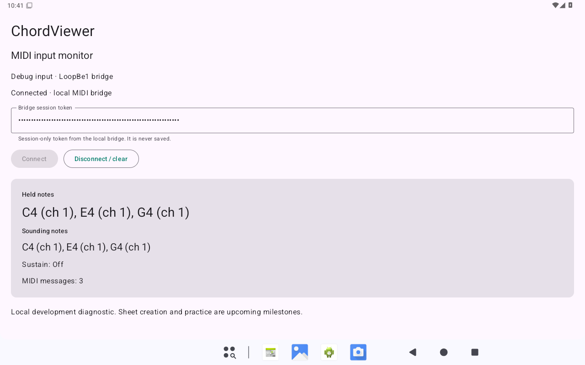
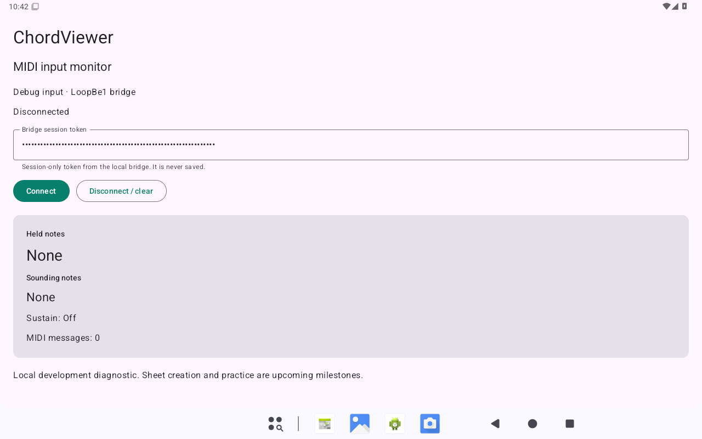

# M1 verification record

Date: 2026-09-20. **M1 is complete.** The native emulator acceptance run passed after selecting a working hardware-graphics configuration. This record distinguishes verified local tooling from later product and physical-device work.

## Passed

- Android SDK, Studio, JDK 21 and tablet AVD installation; published archive checksums verified. Windows Hypervisor Platform reports installed and usable.
- Gradle 8.14.5 wrapper build with JDK 21 and SDK 35: debug APK, release APK and Android test APK, 130 tasks. The initial dependency download/build took approximately 13 minutes.
- All 17 native JVM tests: 11 MIDI parser/state cases and six relay protocol/framing cases; no failures or skips.
- Android lint: zero errors and ten warnings. Warnings concern newer target/dependency versions, future backup extraction rules and the diagnostic app's missing launcher icon. These remain visible for the product foundation/public-launch work; they are not suppressed.
- Built release artifact inspection: no `INTERNET` permission, debug relay classes, token-extra identifier, localhost endpoint or debug connection UI strings in any DEX. The release APK is unsigned, not a distributable public release.
- Windows bridge tests in PowerShell 5.1 and 7 using the real LoopBe input/output: exact fixture bytes and order, monotonic timing, sustain, channels, reconnect reset, invalid authentication, bounded/malformed input, credential ACL and cleanup.
- Earlier direct Chrome/Web MIDI smoke test: C major, sustain release and zero-velocity note-off reached the existing application through LoopBe. This covers the old web reference, not the future rebuilt client.
- Real LoopBe → Windows bridge → native Android instrumentation: exactly one passing, non-skipped test, including held C major, sustained release, zero-velocity note-off, independent channels, final clear and reconnect reset. The sender used the committed fixture at normal speed.
- A second cold boot of the saved profile completed successfully, followed by another passing real LoopBe instrumentation run with a fresh bridge session.
- The AVD setup helper created a profile in an isolated test directory, then validated it on a second run without rewriting it. It also validated the saved working profile. Independent code/security review found no actionable issue.
- Native Activity launched and visually showed incoming C4/E4/G4 on channel 1. Backgrounding the Activity while notes were held, waiting for the launcher to become resumed, and returning showed disconnected input, no held/sounding notes, sustain off and a reset message counter. The development helper reconnected successfully.
- PowerShell syntax checks and local documentation link checks.
- Independent code and security review of native sources, build configuration, Windows bridge, test runner and development helpers. Review findings were fixed: credential-file cleanup ordering, detection of logical Android launch failures, token redaction on metadata errors, fresh-session relaunch, and MIDI cleanup after an interrupted fixture.

## SDK visibility correction

The user's ordinary PowerShell could not find the original SDK, despite successful tests from Codex. A Windows file-handle path check confirmed that `%LOCALAPPDATA%\Android\Sdk` had been redirected into Codex's package-private `LocalCache`. The initial tooling verification did not detect this difference between the two environments.

The installed SDK was copied to `%USERPROFILE%\DeveloperTools\Android\Sdk`, preserving the original copy. All 11,898 copied files matched in size; SHA-256 hashes matched for ADB, the emulator launcher, QEMU, the Android system image and SDK manager launcher. File-handle checks confirmed that the new ADB/system-image paths and the existing AVD configuration resolve to ordinary user directories without package redirection. The SDK directory inherits the user's normal filesystem permissions.

Fresh Windows PowerShell 5.1 and PowerShell 7 checks passed with inherited `ANDROID_HOME` cleared: automatic discovery, repeated initialization without duplicate PATH entries, explicit SDK override, ADB execution, emulator AVD discovery, SDK manager version and existing profile validation. The helper now prefers the stable `DeveloperTools` path after an explicit `ANDROID_HOME`, requires the ADB executable and prints the selected SDK/JDK. Independent code and security review found no actionable issue. These checks verify the corrected physical installation and shell behavior; the user's separate terminal has not yet been rechecked.

The existing tablet profile also booted successfully using the relocated emulator and system image; ADB reported `sys.boot_completed=1`. The test emulator was then stopped for the user's interactive run. The earlier MIDI acceptance results below were not rerun for this filesystem-only correction.

## Emulator configuration and retry

The first boot attempts with the new Emulator 37.1.11 ended in Windows access violation `0xC0000005`. The emulator and first Gradle build running together also caused severe memory pressure. Explicit SwiftShader with Vulkan disabled remained unresponsive both during the build and in a separate retry after Gradle/Kotlin daemons were stopped. ADB listed the virtual device, but shell queries did not complete and Android never reported boot completion. The root cause is not established; memory pressure was observed but is not proven to explain the crash/stall.

After the user requested another attempt, a fresh 1280×800 profile with one virtual CPU still stalled with SwiftShader. Switching that profile to **host graphics** with Vulkan disabled made ADB responsive and Android completed startup. The successful profile is `ChordViewerTabletLocal`, API 35 default x86_64, 160 dpi, one CPU and 2560 MB RAM. The emulator enforces 2560 MB even when a smaller value is requested. The exact software-renderer defect remains undiagnosed; no Windows security, driver or virtualization settings were changed.

The first successful boot took several minutes on the busy 16 GB workstation and showed one System UI not-responding dialog, which recovered after Wait. The application and MIDI test then ran successfully. Build before booting the emulator and stop Gradle daemons to reduce memory pressure. This is functional acceptance, not a claim that resource use has been optimized; combined backend/emulator resource validation remains later work.

The repeatable test is `scripts/development/Test-AndroidMidi.ps1 -Serial <emulator serial>`, with both APKs built and the Windows bridge running. It requires exactly one successful, non-skipped instrumentation test and a successful real LoopBe fixture replay. A unit-test result does not substitute for this check.

The [local setup guide](local-setup.md) and `Initialize-AndroidEmulator.ps1` preserve the working configuration. Native UI evidence:

## Boundaries

No physical piano/tablet is required for the implemented test route. USB/Bluetooth discovery, physical latency and Samsung-specific behavior remain outside emulator coverage. Android Studio's graphical import/build workflow has not been manually exercised; command-line builds use the same checked-in Gradle project and JDK 21.

Source and private configuration were preserved outside the repository before removing generated output and obsolete Supabase temporary metadata. The active legacy web source remains until M2 replaces it. No NAS deployment, cloud deployment, remote resource deletion, push or pull request was performed.
